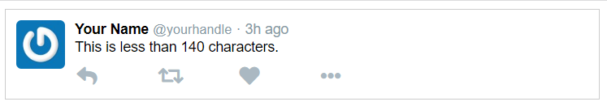
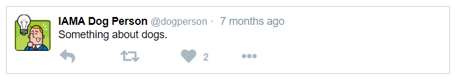

# Project: Tweet With Props

In this project, you'll start with static React components and rework them to display dynamic data using props.

## Starter Code

The starter code is in this repository. Clone it to your machine. Open a command prompt in the repository directory, then run `npm install` to install dependencies. 

Run `npm start` and open [http://localhost:3000](http://localhost:3000) to view the application in your browser. You should see a fairly respectable-looking tweet:

## Steps

### Update the `Tweet` Component

Update the `Tweet` component to accept a `tweet` prop. Pass the `testTweet` object in `index.js` as the `tweet` prop.

Refresh the browser after making these changes. Nothing should be different yet.

### Update the `Avatar` Component

Update the `Avatar` component to take the tweet's `gravatar` property as a prop. Gravatar calls this property a hash, so `hash` would be a good name for the prop.Now update 

`Avatar` will use this new prop to construct the url. The format is https://www.gravatar.com/avatar/hash

### Update the `Message` Component

`Message` should take the tweet's `message` property as a prop. Instead of static text, you’re rendering the `text` prop that was passed in.

Refresh the browser and you’ll see the message is now “Something about dogs.” Success!

## Update the `NameWithHandle` and `Time` Components

Update the `NameWithHandle` to accept the tweet's `author` property as a prop

Update `Time` to take the tweet's `timestamp` as a prop. Notice that some date and time arithmetic will be necessary to convert the timestamp to a relative time staring like "3 days ago."

### Update the Remaining Components

There are only two components left to update: `RetweetButton` and `LikeButton`, which need to display counts of retweets and likes. Currently, they don’t display any numbers at all, just an icon.

It should be clear by now which tweet properties will serve as a prop for these components. As with real Twitter though, if the number of likes or retweets is 0, the component should not render 0, it should render nothing.

Finally, the CSS for the buttons will need to be updated.

### Hints

- If you have your own Gravatar and want to use it, go to <http://daveceddia.com/gravatar> to figure out its URL.
- An alternative to writing your own method to convert timestamp to relative date string would be to explore [one of these libraries](https://momentjs.com/docs/#/-project-status/recommendations/).

### Expected Results

Your avatar may look different but you should expect the updated tweet to look something like this:

